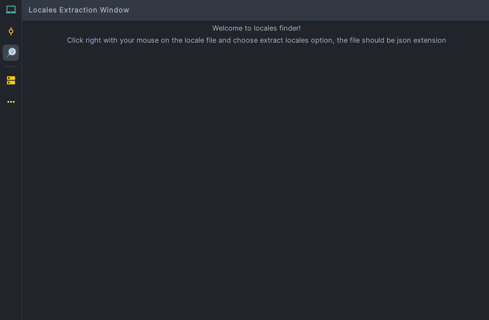
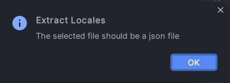
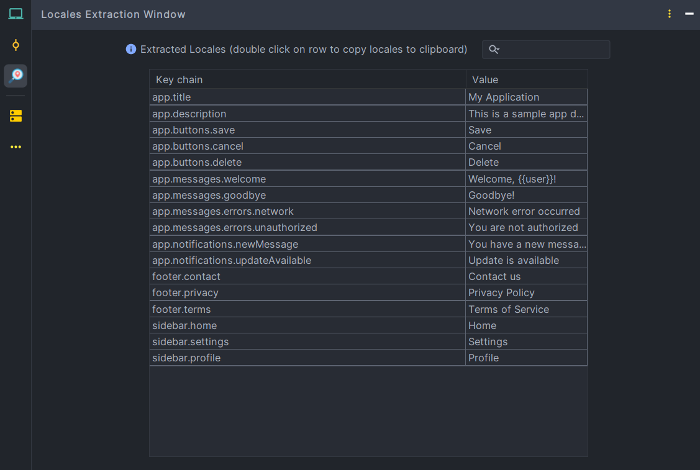
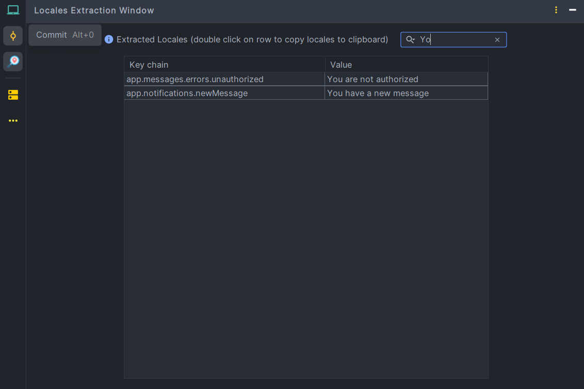
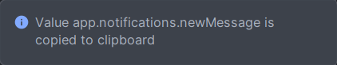
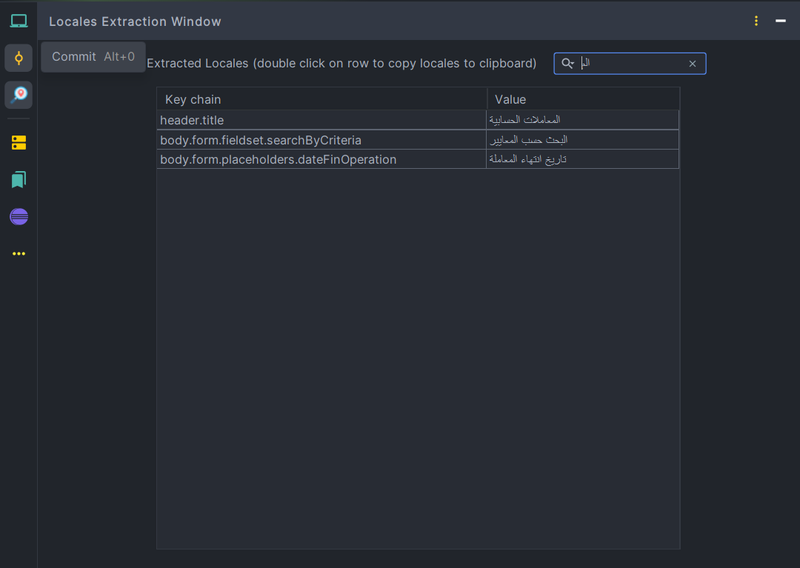

# IntelliJ Locale Key Explorer

**IntelliJ plugin that reads JSON locale files, displays key chains with values in a table, supports search by key or value, and allows copying full paths with a double-click — built with Kotlin, IntelliJ SDK, and Gradle.**

---

## 🛠 Tech Stack

---
## 🚀 Features

- Reads JSON locale files with full UTF-8 support (works with Arabic, accented vowels, and emojis)
- Displays keys as dot-separated chains (`parent.middleChild.child`) alongside their values
- Search functionality: filter table by keys or values
- **Double-click a row to copy the full path or value to clipboard**
- Designed for developers managing multi-language locales
- Simple and intuitive interface inside IntelliJ

---

## 📸 Screenshots

  
*Plugin main view explaining how to extract locales*

---

  
*Error message in case of selecting a non json file*

---

  
*Plugin main table view showing key chains and values.*
*Double-click a row to copy the key chain to clipboard.*

---

  
*Search functionality filtering keys and values.*

---

  
*Clipboard confirmation and feedback after copying a path.*

---

  
*Support for Arabic and accented characters in keys and values.*

---

## 💡 How It Works

1. Install the plugin in IntelliJ IDEA
2. Right click on JSON locale file and choose **Extract Locales**
3. The plugin scans all keys recursively and shows them in a table
4. Use the search box to filter by key or value
5. **Double-click a row to copy the key chain directly to your clipboard**

---

## 📥 Installation

- Clone the repository: `git clone https://github.com/Yassine-Azougagh/Locales-Finder.git`
- Open the project in IntelliJ IDEA
- Build the plugin with Gradle: `./gradlew buildPlugin`
- Install from disk via **Settings → Plugins → Install Plugin from Disk**

---

## 🔗 Links

- [GitHub Repository](https://github.com/Yassine-Azougagh/Locales-Finder.git)

---

**This tool makes managing JSON locale files fast, easy, and error-free — perfect for developers handling multilingual projects.**